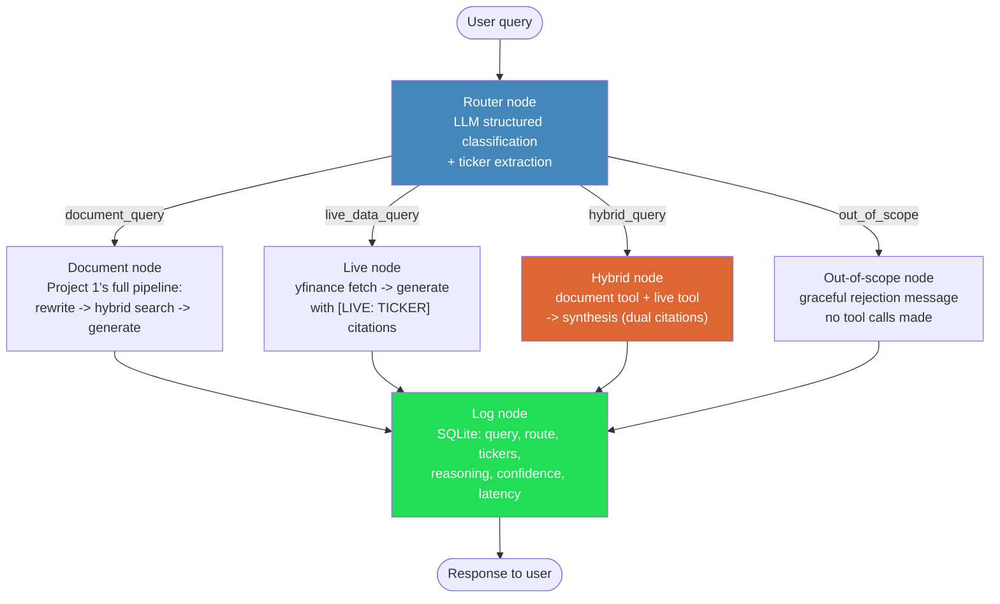
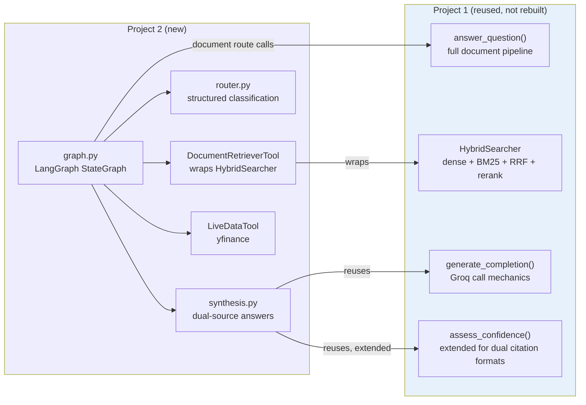

# Project 2 Architecture: Agentic RAG with Query Routing

## Why LangGraph over a simple chain or if/else router

A plain if/else function or a linear LangChain chain can't represent what this
system actually does: the number and shape of steps genuinely differs by query
type. A `document_query` needs one tool call; a `hybrid_query` needs two tool
calls in parallel followed by a synthesis step that neither other path uses.
Modeling this as an **explicit state graph** — nodes for each unit of work,
conditional edges for the branching logic — makes the control flow inspectable
and testable as a first-class object, not implicit in nested conditionals
buried inside a single function. Concretely, this let us unit-test the router,
both tools, and the synthesis step in complete isolation (see Steps 2-5 of the
build log) before ever wiring them together — a linear chain would have forced
integration testing from day one, making it much harder to isolate exactly
where a bug lived, as several were during development (see the decision table
below).

## The decision graph

Every path — including the rejected `out_of_scope` case — flows through the
same logging node before returning, so the routing decision log captures the
agent's full behavior, not just its successes.

## Component reuse from Project 1

Per the project brief, nothing from Project 1's retrieval/generation backbone
was rebuilt. The diagram below shows exactly which pieces are shared vs. new:

One shared `HybridSearcher` instance is loaded once at FastAPI startup and
passed into both Project 1's `/ask` endpoint and Project 2's document tool —
avoiding loading the same ~1.4GB model stack twice.

## Real bugs found through this architecture (evidence, not marketing copy)

Building this as an explicit, independently-testable graph is what surfaced
these — each was caught by testing a component in isolation before it could
propagate silently into a demo:

| Bug | Where caught | Fix |
|---|---|---|
| Router had no "out of scope" category; off-topic questions got force-classified into a financial route | Adversarial router testing (Step 2) | Added 4th route type + few-shot examples |
| Longer prompt (with few-shot examples) caused output token truncation | Edge-case test suite crash | Raised `max_tokens`, added fail-safe error handling |
| `HybridSearcher`'s own entity detection missed "Google" (matches on legal name "Alphabet", not colloquial name) in multi-company queries | Document tool test (Step 3) | Merged router + searcher ticker detection (union, not fallback-only) |
| Citation coverage silently undercounted `[LIVE: TICKER]` citations, since the shared confidence module only recognized `[SOURCE: n]` | Hybrid synthesis test (Step 5) | Extended the shared regex to recognize both formats |