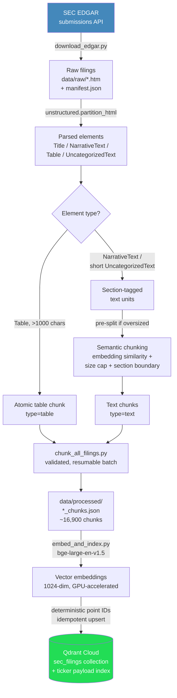
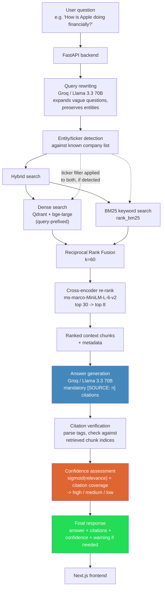

# Multi-Format Enterprise RAG Assistant

A production-grade retrieval-augmented generation system over SEC 10-K/10-Q
filings — built to demonstrate real engineering tradeoffs (messy-document
parsing, hybrid retrieval, citation verification, confidence guardrails)
rather than a tutorial-level "hello world" RAG chatbot.

---

## Problem Statement

Enterprise financial documents are long, structurally inconsistent, and
dense with tables that carry most of the actual signal (revenue, net
income, margins, segment breakdowns). A naive RAG pipeline — fixed-size
chunking, single dense vector search, an LLM that answers from whatever
comes back — fails on this domain in specific, provable ways:

- **Fixed-size chunking destroys tables.** A balance sheet split mid-table
  becomes meaningless numbers with no row/column context.
- **Dense-only retrieval blurs entity boundaries.** Financial statement
  tables across different companies are structurally near-identical, so a
  query naming one company can retrieve another company's numbers at high
  semantic similarity but zero correctness.
- **LLMs answer confidently even when retrieval failed.** Without explicit
  citation verification and a confidence layer, a system can't distinguish
  a well-grounded answer from a plausible-sounding guess.

This project builds an assistant over **68 real SEC filings** (10-K/10-Q,
34 tech-sector companies, ~16,900 chunks) that addresses each failure mode
directly — every design decision below was driven by evidence gathered
from the actual dataset, not assumed upfront.

---

## Architecture

### Offline pipeline (ingestion → indexing)



### Query-time flow (retrieval → generation → guardrails)



---

## Why This Approach (evidence-driven, not assumed)

| Decision | Why | Evidence |
|---|---|---|
| Size heuristic (>1000 chars) to separate real tables from XBRL noise | Raw table counts were dominated by tiny artifact tables (e.g. 214 tables in one filing, only 22 "real") | Full-corpus scan (`scan_all_filings.py`) |
| Regex-based "Item N." section detection instead of relying on `unstructured`'s `Title` category | `unstructured` found **zero** `Title` elements in this HTML; SEC filings use styled divs, not semantic headings | Every chunk defaulted to "Preamble" until fixed — caught by direct inspection |
| Entity/ticker metadata filtering in hybrid search | Financial tables across companies are structurally near-identical; a company-named query returned other companies' data at high relevance | Manual test: "What was Apple's revenue" returned Intel, HP, Intuit data before the fix |
| Sigmoid thresholds for confidence calibrated to 0.35/0.10, not generic 0.6/0.35 | Our best real match (AAPL income statement, near-perfect retrieval) only sigmoid-maps to 0.43 with this cross-encoder | Direct calculation against real test-query scores |
| GPU (Colab) for embedding, not local CPU | Measured 0.4-0.5 chunks/sec on CPU (~8-11 hr projected) vs 9.2-9.3 chunks/sec on T4 GPU (~29 min actual) | Timed runs on both, same corpus |
| Reciprocal Rank Fusion over score normalization | Cosine similarity (0-1) and BM25 scores (unbounded) aren't comparable on raw scale; RRF only needs rank position | Standard IR practice, avoids ad hoc weight tuning |

---

## Tech Stack

| Layer | Choice |
|---|---|
| Ingestion | SEC EDGAR submissions API (official, no scraping) |
| Parsing | `unstructured` (HTML partitioning) |
| Chunking | Custom semantic chunker — table-atomic + embedding-similarity text grouping |
| Embeddings | `BAAI/bge-large-en-v1.5` (1024-dim) |
| Vector DB | Qdrant Cloud |
| Keyword search | `rank_bm25` (BM25Okapi) |
| Fusion | Reciprocal Rank Fusion |
| Re-ranking | `cross-encoder/ms-marco-MiniLM-L-6-v2` |
| Generation | Groq API — Llama 3.3 70B |
| Backend | FastAPI |
| Frontend | Next.js |
| Compute (embedding/re-ranking) | Google Colab (T4 GPU) |

---

## Project Structure

```
enterprise-rag-assistant/
├── README.md                  # this file
├── ARCHITECTURE.md            # extended architecture notes
├── architecture.png           # exported diagram
├── docker-compose.yml
├── requirements.txt
├── .env.example
├── src/
│   ├── ingestion/              # SEC EDGAR download + corpus scanning
│   ├── chunking/                # parsing + semantic chunking + batch runner
│   ├── embedding/               # embedding + Qdrant indexing
│   ├── retrieval/                # hybrid search (dense + BM25 + RRF + re-rank)
│   ├── generation/              # query rewriting + answer generation
│   ├── guardrails/               # confidence/citation verification
│   ├── observability/            # query/response logging
│   └── api/                     # FastAPI app
└── frontend/                   # Next.js app
```

---

## Setup

### 1. Environment
```bash
py -3.11 -m venv venv        # or your Python 3.13, see note below
venv\Scripts\Activate.ps1     # Windows
pip install -r requirements.txt
```

### 2. Environment variables
Copy `.env.example` to `.env` and fill in:
```
GROQ_API_KEY=
QDRANT_URL=
QDRANT_API_KEY=
```

### 3. Run the pipeline (from scratch)
```bash
python -m src.ingestion.download_edgar
python -m src.chunking.chunk_all_filings
python -m src.embedding.embed_and_index     # GPU strongly recommended, see notes below
```

### 4. Run the backend
```bash
uvicorn src.api.main:app --reload
```

### 5. Run the frontend
```bash
cd frontend
npm install
npm run dev
```

**Note on embedding compute:** `bge-large-en-v1.5` across ~16,900 chunks
runs at ~0.4-0.5 chunks/sec on CPU (8+ hours) vs ~9.3 chunks/sec on a T4
GPU (~30 minutes). Running `embed_and_index.py` on Google Colab (free T4
tier) is strongly recommended over local CPU. The script is resumable —
safe to interrupt and re-run, it will skip chunks already indexed in
Qdrant.

---

## Known Limitations / What I'd Improve With More Time

- Section labels aren't capitalization-normalized (`"ITEM 1."` vs
  `"Item 1."` can co-exist) — affects exact-string filtering, not
  retrieval quality.
- A small number of chunks land under a mislabeled section (e.g. content
  grouped under "Item 4. Mine Safety Disclosures" due to short/empty
  sections in some filings) — retrieval still surfaces correct content
  despite this.
- Cross-encoder relevance scores measure entity/topic relatedness, not
  strict question-answerability — confirmed directly by testing a
  deliberately unanswerable question, which still scored high topical
  relevance despite having no real answer in the corpus.
- Citation coverage doesn't yet penalize "citation stuffing" (many sources
  cited on one sentence to hedge, rather than one precise citation per
  claim).
- OpenAI fallback for generation is designed for (single
  `generate_completion` seam in `generate_answer.py`) but not yet
  implemented — Groq-only currently.
- Table-quality filtering is size-based only; legal boilerplate tables
  (e.g. Exhibit Indexes) that happen to be large still get indexed
  alongside genuine financial tables.
- Data source currently limited to tech-sector 10-K/10-Q filings;
  municipal open-data (budgets/reports) from the original scope not yet
  integrated.